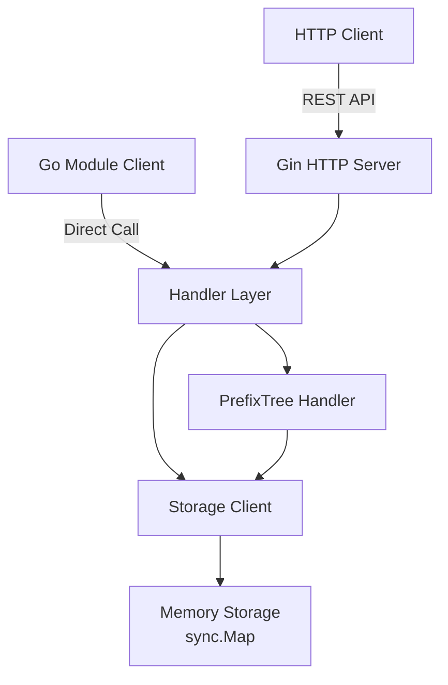

# 技术设计文档：cache-service

## 概述

mcache 是一个支持多级 key 路径的内存键值缓存服务。系统以 `/` 分隔的路径字符串（Prefix）作为唯一标识，通过前缀树（PrefixTree）维护层级关系，底层使用 `sync.Map` 保证并发安全。

系统支持两种集成模式：
- **HTTP 服务模式**：作为独立进程运行，通过 REST API 对外提供服务
- **Module 嵌入模式**：以 Go module 形式直接嵌入宿主程序，共享同一套存储实现

当前技术栈：Go 1.21、Gin v1.9、logrus v1.9。

---

## 架构



### 分层说明

| 层次 | 包路径 | 职责 |
|------|--------|------|
| API 类型层 | `pkg/apis/v1/` | 定义 Item、Storage 接口、PrefixTree 类型 |
| HTTP 路由层 | `pkg/services/rest/` | Gin 路由注册、请求解析、响应格式化 |
| 业务逻辑层 | `pkg/handlers/` | PrefixTree 操作、TTL 检查、数据协调 |
| 存储层 | `pkg/storage/` | Storage 接口代理，当前实现为内存存储 |
| 内存存储 | `pkg/storage/memory/` | sync.Map + prefixList 实现 |

---

## 组件与接口

### Storage 接口（`pkg/apis/v1/storage/types.go`）

```go
type Storage interface {
    GetOne(prefix string) (*item.Item, error)
    ListPrefixData(prefix []string) ([]*item.Item, error)
    CountPrefixData(prefixList []string) int
    ListPrefix(prePrefix string) ([]string, error)
    CountPrefix(prePrefix string) int
    Insert(prefix string, data interface{}, opt ...item.Option) error
    Update(prefix string, data []byte, opt ...item.Option) error
    Delete(prefix string) (interface{}, error)
}
```

**待新增方法**（支持需求 3、5）：
- `Update` 方法需支持 `item.Option` 以传入新 TTL
- `GetOne` 需在返回前检查 `expireTime`，过期则删除并返回 `NoDataError`

### PrefixTree 接口（`pkg/apis/v1/prefix-tree/types.go`）

当前接口仅有 `InsertNode`，需扩展为完整 CRUD：

```go
type PrefixTree interface {
    InsertNode(prefix string, data interface{}) error
    RemoveNode(prefix string) error
    ListNode(prefix string) ([]*item.Item, error)
    SearchNode(prefix string) (*PrefixNode, error)
}
```

### HTTP 路由（`pkg/services/rest/`）

| 方法 | 路径 | 处理函数 | 说明 |
|------|------|----------|------|
| PUT | `/v1/data` | `DataHandler.create` | 创建缓存条目 |
| GET | `/v1/data/:prefix` | `DataHandler.get` | 读取单条 |
| POST | `/v1/data/:prefix` | `DataHandler.update` | 更新条目（待实现） |
| DELETE | `/v1/data/:prefix` | `DataHandler.delete` | 删除条目 |
| GET | `/v1/data/listByPrefix` | `DataHandler.listByPrefix` | 前缀查询 |
| GET | `/v1/prefix` | `PrefixHandler.list` | 列举所有前缀 |
| GET | `/v1/prefix/count` | `PrefixHandler.count` | 统计前缀数量 |
| GET | `/healthz` | 内联 | 健康检查 |

### Module 客户端接口

```go
// pkg/client/cache.go（待新增）
type CacheClient interface {
    Insert(prefix string, data interface{}, opts ...item.Option) error
    Get(prefix string) (*item.Item, error)
    Update(prefix string, data []byte, opts ...item.Option) error
    Delete(prefix string) error
    ListByPrefix(prefix string) ([]*item.Item, error)
}
```

---

## 数据模型

### Item（`pkg/apis/v1/item/types.go`）

```go
type Item struct {
    Prefix     string        `json:"prefix"`
    Data       interface{}   `json:"data"`
    Timeout    time.Duration `json:"timeout,omitempty"`
    ExpireTime time.Time     `json:"expireTime,omitempty"`
    CreatedAt  time.Time     `json:"createdAt"`
    UpdatedAt  time.Time     `json:"UpdatedAt"`
}
```

- `Timeout` 为 0 表示永不过期
- `ExpireTime` = `CreatedAt` + `Timeout`（仅在设置 TTL 时有效）
- `Data` 为 `interface{}`，支持任意 JSON 可序列化类型

### PrefixNode（`pkg/apis/v1/prefix-tree/types.go`）

```go
type PrefixNode struct {
    Prefix    Prefix        `json:"prefix"`
    HasData   bool          `json:"hasData"`
    SubPrefix []*PrefixNode `json:"subPrefix"`
    Timeout   time.Time     `json:"timeout"`
}
```

- `HasData = true` 表示该节点对应的完整路径在 Storage 中有数据
- 中间节点 `HasData` 可为 `false`，仅作路径索引
- 删除末端节点后，中间节点保留，`HasData` 置为 `false`

### PrefixGroup（路径解析结构）

```
输入: "/user/profile/name"
解析:
  RootPrefix: "user"
  PrefixPath: ["profile"]
  NodePrefix: "name"
```

- 前导 `/` 自动去除
- 单段路径：`RootPrefix = NodePrefix`，`PrefixPath = []`

### 错误类型（`pkg/apis/v1/item/errors.go`）

| 错误变量 | 含义 |
|----------|------|
| `NoDataError` | 数据不存在或已过期 |
| `PrefixExisted` | Prefix 已存在，拒绝重复插入 |
| `PrefixNotExisted` | Prefix 不存在，删除/更新失败 |

---

## TTL 过期机制设计

TTL 通过 `item.Option` 函数选项模式注入：

```go
func WithTTL(d time.Duration) item.Option {
    return func(i *item.Item) {
        i.Timeout = d
        i.ExpireTime = time.Now().Add(d)
    }
}
```

过期检查在 `GetOne` 中执行（惰性删除）：

```go
func (m *Memory) GetOne(prefix string) (*item.Item, error) {
    data, has := m.dataMap.Load(prefix)
    if !has {
        return nil, item.NoDataError
    }
    it := data.(*item.Item)
    if !it.ExpireTime.IsZero() && it.ExpireTime.Before(time.Now()) {
        m.Delete(prefix)
        return nil, item.NoDataError
    }
    return it, nil
}
```

**设计决策**：采用惰性删除而非定时扫描，避免后台 goroutine 带来的复杂性，适合当前内存存储规模。

---

## 并发安全设计

- `sync.Map` 保证 `dataMap` 的并发读写安全
- `prefixList` 为普通切片，存在并发写入竞争风险

**待修复**：`prefixList` 的并发写入需加锁保护，或改用 `sync.Map` 存储前缀集合：

```go
type Memory struct {
    mu         sync.RWMutex
    prefixList []string
    dataMap    *sync.Map
}
```

插入/删除 `prefixList` 时持有 `mu` 写锁，`CountPrefix`/`ListPrefix` 持有读锁。

---

## 正确性属性

*属性（Property）是在系统所有合法执行中都应成立的特征或行为，是人类可读规范与机器可验证正确性保证之间的桥梁。*

### 属性 1：插入-查询往返一致性

*对于任意* 合法 Prefix 和 JSON 可序列化的 Data，将其插入后立即查询，应返回与插入时相同的 Data 内容。

**验证需求：1.1、1.4、4.1**

### 属性 2：重复插入拒绝

*对于任意* Prefix，连续插入两次，第二次插入应返回 `PrefixExisted` 错误，且 Storage 中的数据保持第一次插入的值不变。

**验证需求：1.2**

### 属性 3：插入时间戳正确性

*对于任意* 插入操作，插入成功后查询到的 Item，其 `createdAt` 和 `updatedAt` 应在插入操作发生的时间范围内（不早于操作开始时间，不晚于操作结束时间）。

**验证需求：1.3**

### 属性 4：Prefix 解析往返一致性

*对于任意* 合法的多级 Prefix 字符串（含或不含前导 `/`），解析为 PrefixGroup 后重新拼接，应产生与去除前导 `/` 后的原始字符串等价的结果。

**验证需求：2.5、10.1、10.2、10.3、10.4**

### 属性 5：前缀查询完整性

*对于任意* 父路径前缀，在其下插入若干直接子节点后，按该父路径前缀查询，返回列表应恰好包含所有已插入的直接子节点 Item，不多不少。

**验证需求：2.4、4.3**

### 属性 6：TTL 过期行为

*对于任意* 设置了 TTL 的 Item，在 `expireTime` 之后查询，应返回 `NoDataError`；在 `expireTime` 之前查询，应返回正确数据。未设置 TTL 的 Item 永远不应因过期而返回 `NoDataError`。

**验证需求：3.1、3.2、3.3**

### 属性 7：更新保留原有 TTL

*对于任意* 带有 `expireTime` 的 Item，在不提供新 TTL 的情况下更新其 Data，更新后查询到的 `expireTime` 应与更新前完全相同。

**验证需求：3.4、5.3**

### 属性 8：更新后数据一致性

*对于任意* 已存在的 Prefix，更新其 Data 后立即查询，应返回新的 Data 值，且 `updatedAt` 时间戳应晚于原始 `updatedAt`。

**验证需求：5.1**

### 属性 9：删除后不可查询

*对于任意* 已存在的 Prefix，删除后立即查询，应返回 `NoDataError`；对应 PrefixTree 节点的 `HasData` 应为 `false`，但节点本身仍存在于树中。

**验证需求：6.1、6.3**

### 属性 10：并发写入安全性

*对于任意* Prefix，当 N 个 goroutine 并发执行插入操作时，恰好有且仅有一次插入成功，其余均返回 `PrefixExisted` 错误，且最终 Storage 中该 Prefix 对应的数据完整无损。

**验证需求：9.1、9.3**

### 属性 11：空路径前缀查询返回空列表

*对于任意* 不存在子节点的路径前缀，查询应返回空列表而非错误。

**验证需求：4.4**

---

## 错误处理

### 业务错误到 HTTP 状态码映射

| 业务错误 | HTTP 状态码 | 场景 |
|----------|-------------|------|
| `NoDataError` | 404 | 查询/删除不存在的数据 |
| `PrefixExisted` | 409 | 重复插入 |
| `PrefixNotExisted` | 404 | 删除不存在的 Prefix |
| JSON 解析失败 | 400 | 请求体格式非法 |
| 其他内部错误 | 500 | 未预期的系统错误 |

### 错误响应格式

```json
{
  "code": 404,
  "message": "cache not found",
  "timestamp": 1700000000
}
```

**设计决策**：500 错误仅返回错误描述字符串，不暴露 goroutine 堆栈，由 Gin 的 `Recovery()` 中间件兜底处理 panic。

### 边界条件处理

- 空 Prefix：在 Handler 层校验，返回 400
- 前导 `/` 的 Prefix：在 `SplitPrefix()` 中自动去除
- 并发删除同一 Prefix：`sync.Map.Delete` 是幂等的，`prefixList` 删除需加锁

---

## 测试策略

### 双轨测试方法

采用单元测试 + 属性测试互补的方式：
- **单元测试**：验证具体示例、边界条件、错误路径
- **属性测试**：验证对所有输入都成立的通用属性

### 属性测试配置

使用 [gopter](https://github.com/leanovate/gopter) 作为 Go 属性测试库。

每个属性测试最少运行 **100 次**迭代。每个测试用注释标注对应的设计属性：

```go
// Feature: cache-service, Property 1: 插入-查询往返一致性
func TestInsertGetRoundTrip(t *testing.T) {
    properties := gopter.NewProperties(gopter.DefaultTestParameters())
    properties.Property("insert then get returns same data", prop.ForAll(
        func(prefix string, data string) bool {
            // ...
        },
        gen.AlphaString().SuchThat(func(s string) bool { return len(s) > 0 }),
        gen.AlphaString(),
    ))
    properties.TestingRun(t)
}
```

### 单元测试覆盖点

- HTTP 接口：各端点的正常响应、400/404/500 错误码
- `SplitPrefix`：各种路径格式（单段、多段、前导 `/`、空字符串）
- TTL 选项：`WithTTL` 函数的正确计算
- Module 客户端：接口方法的基本调用

### 属性测试覆盖点（对应设计属性）

| 属性编号 | 测试文件 | 生成器策略 |
|----------|----------|------------|
| 属性 1 | `storage/memory/memory_test.go` | 随机 Prefix + 随机 JSON 数据 |
| 属性 2 | `storage/memory/memory_test.go` | 随机 Prefix，插入两次 |
| 属性 3 | `storage/memory/memory_test.go` | 随机 Item，检查时间戳范围 |
| 属性 4 | `apis/v1/prefix-tree/types_test.go` | 随机多级路径字符串 |
| 属性 5 | `handlers/data_test.go` | 随机父路径 + 随机子节点集合 |
| 属性 6 | `storage/memory/memory_test.go` | 随机 TTL（正值/负值/零） |
| 属性 7 | `storage/memory/memory_test.go` | 随机 Item + 随机更新数据 |
| 属性 8 | `storage/memory/memory_test.go` | 随机 Prefix + 两个不同 Data |
| 属性 9 | `handlers/data_test.go` | 随机 Prefix，插入后删除 |
| 属性 10 | `storage/memory/memory_test.go` | 固定 Prefix，N goroutine 并发插入 |
| 属性 11 | `handlers/data_test.go` | 随机不存在子节点的路径 |
