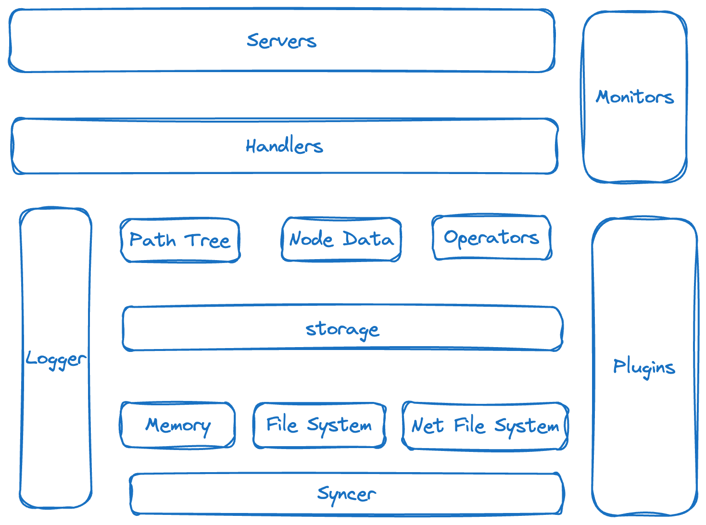

# MCache

## 背景说明

`MCache`是一个内存缓存工具，一开始写这个工具主要是因为自己的一些项目经常需要在内存里缓存一些数据，并要实现类似于`redis`这种成型的缓存工具中都具备的一些多级查找、过期时间、类型等各种丰富的功能，但又不想引入一个外部的服务增加网络复杂性，因此就想自己手写一个共用的模块，哪里需要就在哪里集成就行了。

但基于给自己提升能力的目的，我也想在这样的基础上进行功能扩展，让`MCache`能具备更多的能力，因此，我简单规划了下，后续会逐渐在里面实现几个方向的功能，当然，作为最基础的能力内置集成这块保证不受到影响。后续会增加`HTTP`、`GRPC`、`QUICK`、`WS`等多种协议，同时提供`Watch`机制，当然也有可能引入`raft`支持多节点同步的效果。

## 框架设计

主体模块分三层:

- `servers`: 负责对外提供各种使用入口，包括内置集成、`HTTP`、`RPC`等等

- `Handlers`: 负责在支撑对外的`server`，执行实际的操作，包括读、写、删除等
- `Pkg`: 主要的逻辑区域，包含路径树，节点数据，各类操作`operator`(没想好要做成什么样😂),还有实际的存储落盘的操作等等

外部支持`Monitor`,可以自定义插件集成到服务中，然后向上提供监控支撑，当然也支持外部注册

## 最后

大家如果觉得有什么不合理的或者有什么好点子，欢迎`issue`，当然，别嘲笑我==、我承认我是菜鸡。欢迎加我微信聊或者emial我

- Email: [EvansChang](https://github.com/AlpherJang)(alphejangs@gmail.com)
- Wx: evanxtay
